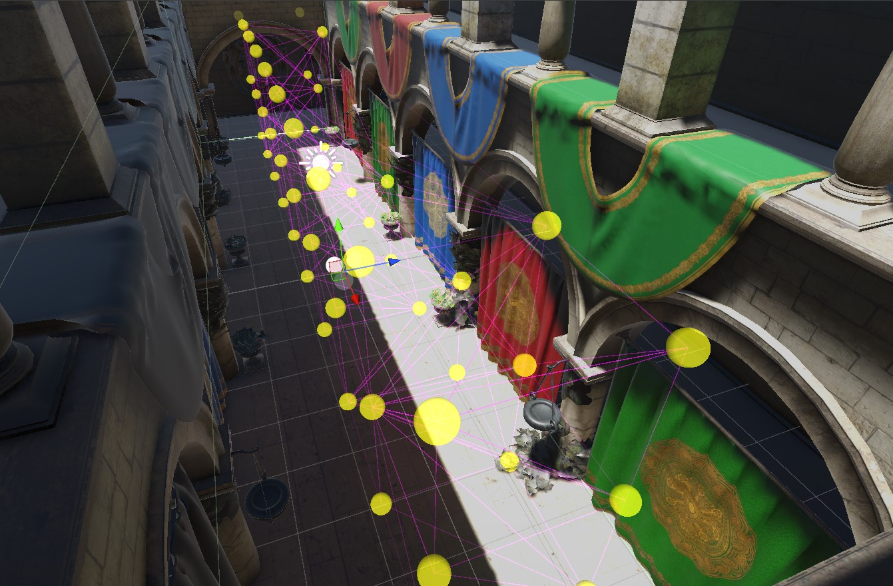

# LPNN

This is the repo containing my Thesis project about using AI to intelligently place Light Probes in a 3D-scene inside the Unity game engine.

Completed during my final year of studies in the [Department of Computer Science & Engineering](https://www.cse.uoi.gr/?lang=en) of [University of Ioannina](https://uoi.gr/), in 2025.

The repository contains 3 folders, briefly described here:
- [*LPNN_python_AI_training*](LPNN_python_AI_training)
  - Contains the python code used for formatting the data and training the AI model. Outputs a .onnx file with the trained model
- [*LPNN_Unity_Project*](LPNN_Unity_Project)
  - Contains the Unity 6 project. It includes the system that uses the AI to place the LightProbes, and the system used to extract the labels for manual training
of a new AI. Additionally, it contains the user controls for fine-tuning.
- [*Thesis_Report_code*](Thesis_Report_code)
  - Contains the LaTeX code and media used to create the .pdf of the Thesis presentation. Additionally, it contains the PowerPoint used to defend the Thesis.

The whole repository is licensed under the MIT License found in the [LICENSE](LICENSE) file.

# About the Thesis

In this thesis, a tool to automatically evaluate scene positions and place Light Probes was created, using AI. The term "***LPNN***" is short-hand for "*Light Probe Neural Network*", refering to the entire system and the architecture of the AI model.

A direct replica of the *Abstract* of the thesis follows. It can also be found in the [*Thesis_Report_code/*](Thesis_Report_code) folder, in [*this file*](Thesis_Report_code/main.pdf).

For more details on how the system works, how to use it, how to extract custom labels and how to train a new AI model, please refer to the .pdf of the Thesis [here](Thesis_Report_code/main.pdf).

## Abstract
Realistic lighting is a cornerstone of visually compelling 3D graphics. Unity’s Light Probe system offers an efficient way to capture and interpolate baked Global Illumination (GI) data across dynamic objects in scenes. However, manual placement of light probes in complex scenes is both time-consuming and error-prone, greatly delaying the iteration process when making 3D applications. This thesis presents an automated, deep learning
based approach that predicts per-point importance scores for light probe placement using a PointNet-inspired neural network.

We first generate a regular 3D point grid that conforms to the user-defined arbitrarily
shaped bounds of the scene. We sample per-point lighting information, including spherical harmonics, light-, normal-, and RGB- variance, and occlusion factor as well. These features capture important information that drive GI accuracy. The data is then converted into a concise feature vector at each location, used to then train the PointNet-style AI model that consumes an arbitrary-length list of such feature vectors and outputs a probability in the range 0-1, depicting how vital it is to place a light probe at each point on the grid.

To deploy in Unity, the trained model is then exported to an .ONNX file and imported via Sentis, the official Unity package for handling AI models inside a Unity Runtime; at edit-time, it ingests per-point scene data and returns per-point importance values. Predicted high-importance locations are then used to populate a Unity LightProbeGroup object, giving developers immediate, visually appropriate probe distributions, with easy to control thresh-holding if higher- or lower-importance locations are desired.

We demonstrate that our AI model generalizes across grid sizes and shapes without retraining, as well as giving immediate results for any scene. Although our evaluation remains mostly qualitative, based on visual inspection of GI results and light-probe placement across a variety of indoor and outdoor scenes, we consistently observe that the generated probe layouts capture important scene light-data with minimal or no manual tweaking. By replacing manual probe placement with a simpler AI-based workflow, artists and developers save time and achieve a faster iteration process throughout the development of a 3D application.