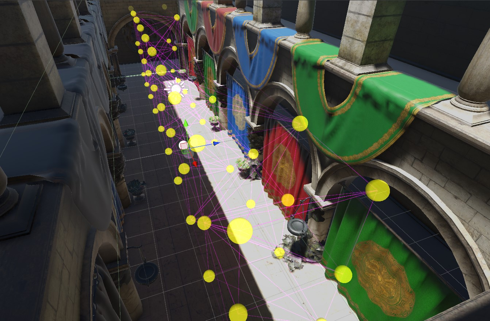

# LPNN

This is the repository containing the source code of my Thesis project about using AI to intelligently place Light Probes in a 3D-scene inside the Unity game engine, presented as a *[Eurographics 2026 Poster: Deep Illumination–Guided Light Probe Placement](https://diglib.eg.org/handle/10.2312/3607272)*, in collaboration with [A. A. Vasilakis](https://orcid.org/0000-0001-6895-3324) and [I. Fudos](https://orcid.org/0000-0002-4137-0986).

Completed during my final year of studies in the [Department of Computer Science & Engineering](https://www.cse.uoi.gr/?lang=en) of [University of Ioannina](https://uoi.gr/), in 2025. Original Thesis version, prior to any changes made, can be found [here](https://github.com/AndreasTar/LPNN/releases/tag/Original) or in the *Releases* section of the repository.

The repository contains 3 folders, briefly described here:
- [*LPNN_python_AI_training*](LPNN_python_AI_training)
  - Contains the python code used for formatting the data and training the AI model. Outputs a .onnx file with the trained model
- [*LPNN_Unity_Project*](LPNN_Unity_Project)
  - Contains the Unity 6 project. It includes the system that uses the AI to place the LightProbes, and the system used to extract the labels for manual training
of a new AI. Additionally, it contains the user controls for fine-tuning.
- [*Thesis_Report_code*](Thesis_Report_code)
  - Contains the LaTeX code and media used to create the .pdf of the Thesis presentation. Additionally, it contains the PowerPoint used to defend the Thesis.

The whole repository is licensed under the MIT License found in the [LICENSE](LICENSE) file.

# About the Thesis

In this thesis, a tool to automatically evaluate scene positions and place Light Probes was created, using AI. The term "***LPNN***" is short-hand for "*Light Probe Neural Network*", refering to the entire system and the architecture of the AI model.

A direct replica of the *Abstract* of the thesis follows. It can also be found in the [*Thesis_Report_code/*](Thesis_Report_code) folder, in [*this file*](Thesis_Report_code/main.pdf).

For more details on how the system works, how to use it, how to extract custom labels and how to train a new AI model, please refer to the .pdf of the Thesis [here](Thesis_Report_code/main.pdf).

## Abstract
This work proposes an automated learning-based strategy for computing light probe layouts efficiently under varied illumination conditions. A neural network model estimates the relative contribution of candidate probes, enabling the rapid construction of a compact configuration that maintains the scene’s indirect lighting distribution. Evaluations on complex environments indicate that the method achieves substantial speedups over conventional placement methods without compromising illumination fidelity.

## How to Cite
The license is [MIT](LICENSE). If you use the contents of this repository for your work, please cite it as described below:

### LaTeX and BibTeX example usage

<blockquote>
<pre style="white-space:pre-wrap;">
In our work, we have used the source code ~\cite{tarasidis_2026}, available at <em>'https://github.com/AndreasTar/LPNN'</em>.
</pre>

<pre style="white-space:pre-wrap;">
@article{tarasidis_2026
    booktitle = {Eurographics 2026 - Posters},
    editor = {Gerrits, T. and Teschner M.},
    title = {Deep Illumination–Guided Light Probe Placement}},
    author = {Tarasidis, Andreas and Vasilakis, Andreas A. and Fudos, Ioannis},
    year = {2026},
    publisher = {The Eurographics Association}
}
</pre>
</blockquote>
